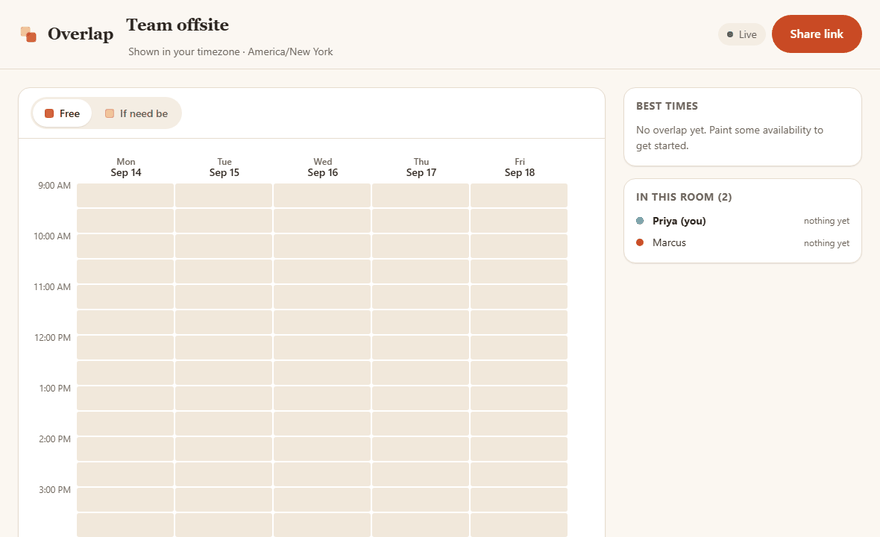
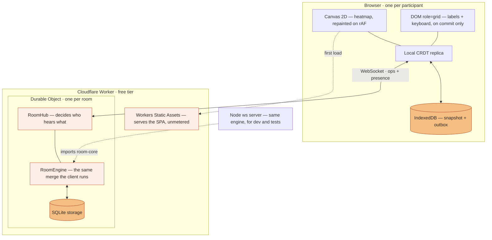

# Overlap

**Find a time that works for everyone.** Share one link. Everyone paints when they're free — in
their own timezone — and the overlap appears as you go. No accounts, no install, works offline.



> Recorded against the live deployment, not a mock-up. Three real browser sessions, one room.

### ▶︎ [overlap.gigantic-broom.workers.dev](https://overlap.gigantic-broom.workers.dev)

Open it, make a room, and send the URL to someone. That's the whole product.

> **This link is a Cloudflare _preview_ deploy and it expires.** It was published without an
> account — `wrangler deploy --temporary` — so there is nothing keeping it alive. If it is dead
> by the time you read this, `pnpm install && wrangler login && pnpm deploy` puts the identical
> build on a permanent `workers.dev` subdomain in about a minute. Nothing else changes: the
> whole E2E suite passes against the deployed origin either way, and `pnpm dev` runs the same
> product locally with no account at all.

---

## What it does

- **Drag to paint** when you're free. Drag again over the same cells to clear them.
- **Everything is live** — other people's cursors, their marks, and the heatmap, as they happen.
- **Everyone sees their own timezone.** A room created 9am–5pm in New York shows up as
  6:30pm–2:30am in Kolkata, on the correct dates, at the correct half-hour offset.
- **Best times** are ranked as you go, counting each person at their _worst_ level across the
  whole window rather than averaging per slot.
- **It works offline.** Paint on the tube; it syncs when you surface, and nothing is lost.
- **Fully keyboard operable**, with screen-reader labels on every cell.

---

## Architecture



| Package              | What it is                                                            | Runtime deps    |
| -------------------- | --------------------------------------------------------------------- | --------------- |
| `@overlap/time`      | IANA timezone kernel — offsets, wall-time resolution, slot generation | **none**        |
| `@overlap/crdt`      | Hybrid logical clock + LWW register map                               | **none**        |
| `@overlap/protocol`  | Zod schemas for every wire and stored shape                           | zod             |
| `@overlap/room-core` | Room engine, connection hub, and client sync engine                   | the three above |
| `apps/web`           | React client                                                          | react           |
| `apps/edge`          | Cloudflare Worker + Durable Object (production)                       | —               |
| `apps/dev-server`    | Node.js `ws` server (dev + integration tests)                         | ws              |

**The server is not a coordinator.** It is a relay and a durable replica that runs the
_identical_ merge function the clients run, imported from the same package. There is no
server-only ordering logic that could disagree with a client, which is also why the multi-client
convergence tests can run the entire system in one process.

---

## The engineering decisions

Full reasoning in [`docs/PLAN.md`](docs/PLAN.md) and seven ADRs in [`docs/adr/`](docs/adr).
The short version:

### Conflict resolution: a map of LWW registers, not OT and not a CRDT library

The decisive fact about this domain is that **state is keyed by (participant, instant), and a
participant only ever writes their own cells**. Six people painting the same grid at once are
writing six disjoint key sets. There is no conflict at all in the common case.

So room state is a grow-only map of last-writer-wins registers stamped by a **hybrid logical
clock**. Merge is per-key maximum over a total order, which makes it commutative, associative and
idempotent — a join-semilattice, giving strong eventual consistency. Three things fall out:

- **Replaying the offline outbox is free.** Idempotence means no dedup table, no sequence-number
  negotiation, no acknowledgement bookkeeping beyond "you can stop retrying these".
- **Optimistic writes need no rollback.** A locally-applied value is already a valid replica
  value, so there is no pending state and nothing ever snaps back.
- **The server needs no authority.** It merges like everyone else.

OT was rejected because it exists to preserve _positional intent_ in sequences; our keys are
absolute instants and never shift. Yjs and Automerge would both work, but cost 40–90 KB gzipped
to hold what is ultimately a map of enums, and would bring tombstone and GC semantics to a model
that has neither. [ADR-0001](docs/adr/0001-conflict-resolution.md)

**Writing the property tests found a real hole.** Asserting commutativity directly — rather than
checking a handful of interleavings by hand — failed immediately: two writers sharing an actor id
can mint byte-identical stamps, and replicas that saw them in different orders diverged silently.
Fixed by splitting identity into a stable `participantId` and a per-tab `sessionId`, and by making
the register order total on `(stamp, value)` so even a forged duplicate cannot diverge.
[ADR-0007](docs/adr/0007-identity-without-accounts.md)

### Timezones: absolute instants, and a zero-dependency kernel

**The canonical unit of time is an absolute UTC instant. Nothing else is ever stored.** A room
stores its _shape_ — anchor zone, dates, daily window — and slots are materialised by resolving
each wall time against the real IANA rules, which yields exactly three outcomes:

| Case               | Instants | What happens                                                                      |
| ------------------ | -------- | --------------------------------------------------------------------------------- |
| Normal             | 1        | An ordinary slot                                                                  |
| **Spring forward** | 0        | The hour does not exist. The grid says so instead of silently shortening the day. |
| **Fall back**      | 2        | **Both** occurrences are kept as distinct slots, labelled `EDT` and `EST`.        |

That last row is the one nearly every implementation collapses, quietly deleting an hour of real
availability once a year. Because offsets are always resolved _at an instant_, the full IANA
history applies for free — Brazil abolishing DST in 2019, Egypt reintroducing it in 2023, Lord
Howe's 30-minute shift, Chatham's +12:45.

Built on `Intl.DateTimeFormat` in ~150 lines rather than importing `temporal-polyfill`, which is
semantically ideal but ~50 KB gzipped against a mobile-first budget for about six operations.
[ADR-0004](docs/adr/0004-timezone-model.md)

A detail that shows the model working: the slot spanning a spring-forward reads as
**"1:30 AM to 3:00 AM"** — thirty real minutes across a clock that jumped an hour in the middle.
Deriving the end from the instant rather than from the label is what gets that right.

### Rendering: canvas for pixels, DOM for semantics

A large room is 672 cells. Repainting those as DOM nodes on every `pointermove` is style-recalc
and paint work on the main thread of exactly the device that has to stay smooth. So the heatmap
is a single canvas, repainted on an animation frame, and the accessibility layer is a parallel
DOM `role="grid"` with one focusable cell per slot — rewritten **only on commit**, never during a
drag, so it costs nothing in the interaction it overlays.

The drag reads `getCoalescedEvents()` and interpolates between samples, so a fast flick paints
every cell it crossed rather than the two the browser happened to sample.
[ADR-0005](docs/adr/0005-grid-rendering.md)

### Hosting: one Cloudflare Worker, genuinely free

A Durable Object _is_ the single-threaded per-room actor this design already wanted, so applying
an op and broadcasting it has no read-modify-write race and needs no locking. Static assets are
free and unmetered, WebSocket Hibernation means an idle room costs nothing, and one origin means
no CORS and one deploy. Render was rejected because it cold-starts after ~15 minutes idle — and
"idle for days, then a burst when someone opens the link" is precisely this product's traffic
shape. [ADR-0006](docs/adr/0006-hosting.md)

Vendor lock-in is confined to one ~150-line file: `apps/dev-server` runs the same engine on plain
Node, and the integration suite proves it.

---

## Testing

**208 tests.** 177 unit and integration, 31 end-to-end — and the E2E suite runs against
**production** as well as locally.

```bash
pnpm verify     # lint, typecheck, test, build — what CI runs
pnpm test:e2e   # Playwright, desktop + Pixel 5
OVERLAP_BASE_URL=https://overlap.gigantic-broom.workers.dev pnpm test:e2e   # against production
```

What is actually asserted, rather than assumed:

- **Convergence as an algebraic property.** Property-based tests over random write sets assert
  commutativity, associativity, idempotence, and convergence under shuffling and duplication.
- **Multi-client, byte-identical.** Integration tests drive real `RoomClient` instances over real
  WebSockets; E2E drives three independent browser contexts painting concurrently.
- **Offline for real.** Partition, paint on both sides, heal, assert nothing lost — plus a check
  that the marks reached IndexedDB rather than only living in a heap about to be discarded.
- **Timezones against a table of real transitions** in eight zones, including 30-minute and
  45-minute offsets and historical rule changes.
- **Accessibility**: axe clean on both views, plus a test that completes a whole room by keyboard.

CI gates every PR on lint, typecheck, tests, build, E2E, and Conventional Commit messages. Both
`main` and `develop` are protected with those checks required, linear history, and admin
enforcement on.

Four real bugs came out of writing these, all documented in the PRs: the accessibility layer
swallowing every pointer event, a stale closure that stopped the canvas ever resizing, two
WCAG contrast failures, and offline marks that persisted but were never replayed on boot.

---

## Known limitations

Honest ones, not a shrug:

1. **The deployed URL is a temporary Cloudflare preview, and it does expire.** It was published
   without an account, so nothing keeps it alive — the first one lasted a few hours. Every
   deploy is verified by running the whole E2E suite against the live origin (31/31), so the
   build is known good; it is the _hosting_ that is ephemeral. `wrangler login && pnpm deploy`
   puts the identical artifact on a permanent subdomain.
2. **The same person on two devices is two participants.** Phone and laptop each get their own
   `participantId`. Resuming identity across devices without accounts needs either a secret in
   the URL — one paste away from handing someone else your identity — or name-matching, which
   lets anyone impersonate anyone. Neither is worth it. [ADR-0007](docs/adr/0007-identity-without-accounts.md)
3. **Anyone with the link can edit the room title and pin a time.** There are no roles, because
   there are no accounts to hang them on.
4. **The full snapshot is sent on connect**, not a delta. A scalar cursor is unsafe when peers'
   clocks differ, and a correct delta needs a version vector. Fine at realistic room sizes
   (~100 KB); wasteful at the 2,000-slot ceiling.
5. **No WebSocket fallback.** A small number of corporate proxies block them outright, and there
   is no long-polling path.
6. **Rooms are swept 60 days after their last write.** A deliberate retention policy, stated
   rather than implied.
7. **Free-tier ceilings are per-account**: 100k requests/day, ~3M row-writes/month.
8. **A device whose clock is more than five minutes off has its writes rejected** by the server.
   That is the correct trade against one bad clock winning every conflict forever, but it is a
   hard failure rather than a graceful one.
9. **~92 KB gzipped**, most of it React and Zod. Fine, but not the tiny bundle the
   zero-dependency packages might suggest.
10. **Cut deliberately**: recurring windows, duration constraints, calendar import, and a QR code
    for sharing. Reasoning for each in [`docs/PLAN.md`](docs/PLAN.md).

---

## Running it locally

```bash
pnpm install
pnpm dev        # Vite client on :5173, Node WebSocket server on :8787
```

Open two browser windows on the same room URL to see it sync.

```bash
pnpm verify     # everything CI runs
pnpm deploy     # Cloudflare — needs `wrangler login` first
```

## Repository

```
docs/           PLAN.md, TEST-STRATEGY.md, and seven ADRs
packages/       time · crdt · protocol · room-core
apps/           web · edge (Cloudflare) · dev-server (Node)
e2e/            Playwright specs — also runnable against production
scripts/        demo recorder and GIF encoder
```

Built with strict TypeScript throughout — `noUncheckedIndexedAccess` on, the `no-unsafe-*` rule
family set to error, and no `any` anywhere in the shipped product.

## Licence

[MIT](LICENSE)
